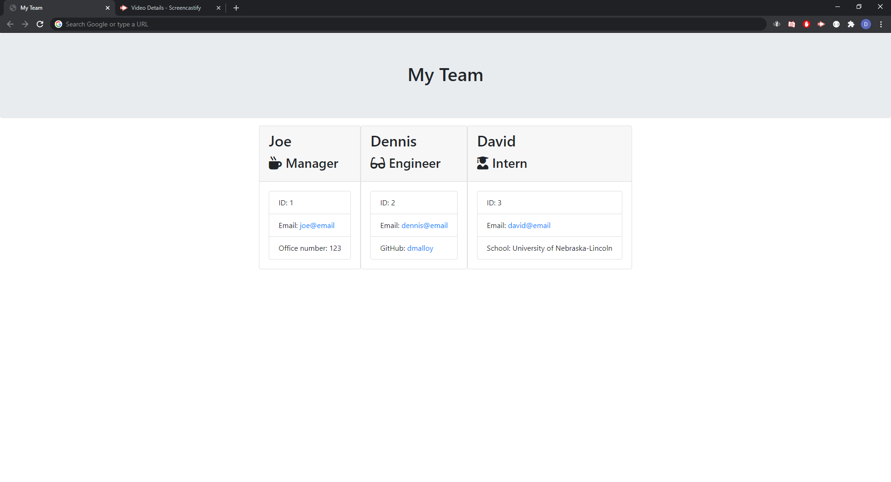

# Employee-Team-Builder

### Author: David Guthmann

github: https://github.com/Dguthmann/Employee-Team-Builder  
livesite: N/A  

## List of Contents

app.js  
package.json
package-lock.json
README.md  
LICENSE   
### lib
Employee.js  
Engineer.js  
htmlRenderer.js  
Intern.js  
Manager.js  
### templates  
employee.html  
engineer.html  
main.html  
manager.html  
### test  
Employee.test.js  
Engineer.test.js  
Intern.test.js  
Manager.test.js  
### output  
team.html  

## Installation
you will need the following additional npms to run this project:  
inquirer
jest (for further development only)

## Basic Overview of Project

The goal of the project is to generate a new html file with team information dynamically using node and js.  

## Screenshot of Project

## Resources Used

N/A

## Further Development Plans

Project is considered complete as the pace of the class is dictating my timeframe to work on projects

## Changelog

2020-10-06: Final testing readme
2020-10-05: Writing of most of the code and functionality
